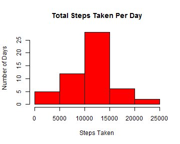
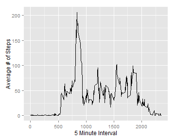
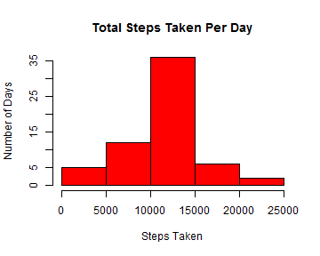
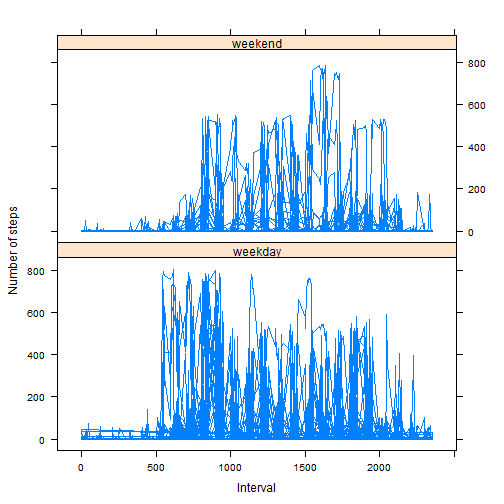

### Data
_____________________________________________________________________________
The data for this assignment can be downloaded from the course web site:

Dataset: [Activity monitoring data](https://d396qusza40orc.cloudfront.net/repdata%2Fdata%2Factivity.zip) [52K]

The variables included in this dataset are:

**steps**: Number of steps taking in a 5-minute interval (missing values are coded as NA)

**date**: The date on which the measurement was taken in YYYY-MM-DD format

**interval**: Identifier for the 5-minute interval in which measurement was taken

The dataset is stored in a comma-separated-value (CSV) file and there are a total of 17,568 observations in this dataset.

(Note:  This information was taken directly from the master branch created by R. Peng [here](https://github.com/rdpeng/RepData_PeerAssessment1).  All data analysis, figures, and comments were created by Raphael Kurlansik.)


### Loading and preprocessing the data   
_____________________________________________________________________________  
To get started, load the dplyr, ggplot2, lubridate, and lattice packages. Then read the file into R as a data.table specifying the 'date' class, and remove NA's. 


```r
library(dplyr)
library(ggplot2)
library(lubridate)
library(lattice)
```


```r
raw.actv <- read.table("activity.csv", 
        sep = ",",
        na.strings = "NA", header = TRUE,
        colClasses = c("integer", "Date", "integer"))

actv.df <- na.omit(raw.actv) ## New dataframe without NAs
```


### What is mean total number of steps taken per day?
_________________________________________________________________

Group the data by 'date' and then summarize for the total number of steps taken.


```r
by_date <- group_by(actv.df, date)
step.total <- summarize(by_date, sum(steps))
colnames(step.total)[2] <- "total.steps"  # Rename column for clarity
```

Now lets build a histogram with the total steps taken per day. 


```r
hist(step.total$total.steps, main = "Total Steps Taken Per Day", 
        xlab = "Steps Taken", 
        ylab = "Number of Days", 
        col = "red")
```

 

Finally, calculate and report the mean and median of the total number of steps taken per day.

```r
mean(step.total$total.steps)
```

```
## [1] 10766.19
```

```r
median(step.total$total.steps)
```

```
## [1] 10765
```

###What is the average daily pattern activity?
______________________________________________________________

To find this value we need to plot 5 minute intervals on the x-axis and the average number of steps for each interval on the y-axis.  This time group the data by 'interval', then summarize for the mean steps taken in each interval.


```r
by_interval <- group_by(actv.df, interval)
int_means <- summarize(by_interval, mean(steps))
colnames(int_means)[2] <- "Average.Steps"
qplot(int_means$interval, int_means$Average.Steps, 
        geom = "line",
        xlab = "5 Minute Interval", 
        ylab = "Average # of Steps")
```

 

Find the 5-minute interval with the greatest average steps across all days.

```r
int_means[which.max(int_means$Average.Steps),]
```

```
## Source: local data frame [1 x 2]
## 
##   interval Average.Steps
## 1      835      206.1698
```

### Imputing missing values
__________________________________________________________________________________________

Missing values can influence the results of an analysis.  Lets see if that is a concern with this data.  We began by removing NAs, but now lets see how many NAs are in our raw data:


```r
sum(is.na(raw.actv$steps))
```

```
## [1] 2304
```

```r
sum(is.na(raw.actv$steps))/nrow(raw.actv) ## Percentage of total rows that are NA
```

```
## [1] 0.1311475
```

As you can see, the steps NAs represent about 13% of the steps data.  This could be significant.  Using a for loop, replace these NAs with the average number of steps for that interval across all days. 


```r
imputed.actv <- raw.actv  ## Copy of raw data 
for(i in 1:17568){  # Number of rows
   if(is.na(imputed.actv$steps[i]) == TRUE){  
       imputed.actv$steps[i] <- int_means$Average.Steps[  
       which(int_means$interval == imputed.actv$interval[i])
       ]  ##  Replace the 'i'th row containing NA with the mean steps matched by interval
   }
}
```

We'd like to know if there are any noticeable differences between the imputed data set and one with NAs removed.  Lets look at a histogram of imputed.actv and check out the mean/median.


```r
by_date.imp <- group_by(imputed.actv, date)
step.total2 <- summarize(by_date.imp, sum(steps))
colnames(step.total2)[2] <- "total.steps"

hist(step.total2$total.steps, main = "Total Steps Taken Per Day", 
        xlab = "Steps Taken", 
        ylab = "Number of Days", 
        col = "red")
```

 

```r
mean(step.total2$total.steps)
```

```
## [1] 10766.19
```

```r
median(step.total2$total.steps)
```

```
## [1] 10766.19
```

There are two key differences between the actv.df and imputed.actv data sets.  First, the replacement of NAs has effectively created 8 new days being measured in the data set.  With NAs removed, summarized data consisted of 53 rows.  The imputed data, however, has 61 rows.    Second, these days all contribute to the largest column in the histogram. This makes sense because their values are based on the means of the data set, not the outliers.  However, where did these additional days come from?  
<br>
If you recall, when we counted the NAs, we found 2304.  There are 288 unique values in the 'interval' column.  2304 divided by 288 is exactly ... 8!  Assigning mean values to the NAs added enough values to the data set to fill 8 days.  In hindsight, this could have been predicted, since we knew the NA count and the unique intervals.

<br>
Finally, the mean and median for steps taken in a day are essentially the same in both sets, the only minor discrepancy being the imputed sets' median becoming equivalent to its mean.

### Are there differences in activity patterns between weekdays and weekends?
_______________________________________________________________________________________________
To answer this question, we must create a new variable that will tell us which type of day it is.  Add a new variable to imputed.actv called 'day' and fill it by calling the wday() function on the 'date' variable.  Now we can transform the values in 'day' to a factor with two levels, 'weekday' and 'weekend'.


```r
imputed.actv["day"] <- wday(imputed.actv$date)
imputed.actv$day[imputed.actv$day == 1]  <- "weekend"
imputed.actv$day[imputed.actv$day == 7] <- "weekend"
imputed.actv$day[imputed.actv$day != "weekend"] <- "weekday"
imputed.actv$day <- factor(imputed.actv$day, levels = c("weekday", "weekend"))

p <- xyplot(imputed.actv$steps ~ imputed.actv$interval | day, 
       data = imputed.actv, 
       layout = c(1,2), 
       type = "l", 
       xlab = "Interval", 
       ylab = "Number of steps")
print(p)
```

 

There is a clear difference between steps taken on the weekend vs the weekdays.  The morning is much busier on weekdays, and the evening is busier on the weekend.  This makes intuitive sense as people have active mornings on weekdays (getting everyone in the house ready to go to school, commuting) and perhaps go out for entertainment or to run errands in the afternoon.  It also appears that perhaps people like to sleep in on the weekends!
<br><br><br><br>
